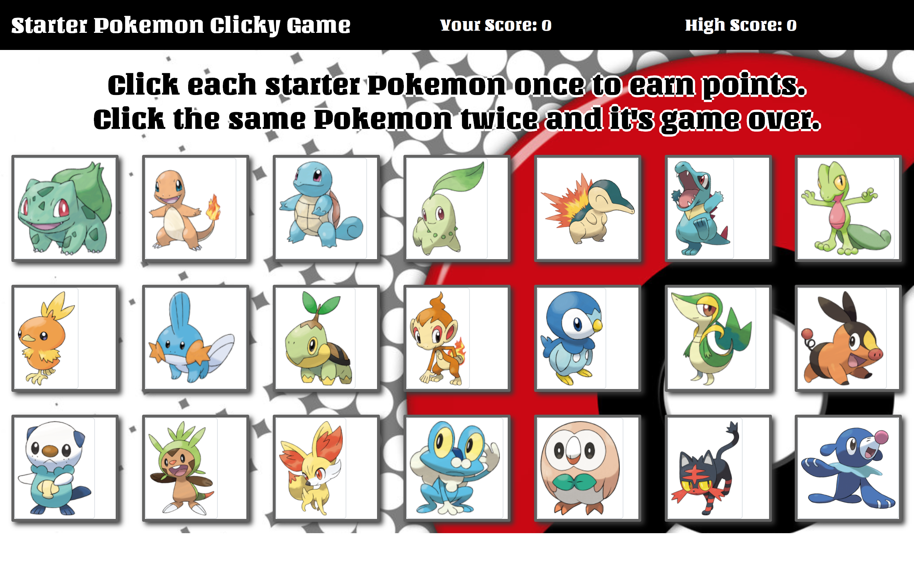

<h1>Starter Pokemon Clicky Game</h1>

<h2>What is it?</h2>
A memory game created with React featuring the starter Pokemon from Kanto all the way up to Alola. The challenge of this assignment was to break up the application's UI into components, manage component state, and respond to user events.

<h2>Built With</h2>
<ul>
  <li>React</li>
  <li>Yarn</li>
  <li>CSS</li>
  <li>Bootstrap</li>
  <li>Google Fonts</li>
  <li>JavaScript</li>
  <li>NodeJS</li>
</ul>

<h2>How does it work?</h2>
The object of the game is to click every starter Pokemon once without clicking any twice. The game begins when you click on your first Pokemon. After each click, the Pokemon will be shuffled, challenging you to remember which ones you havent clicked yet. You'll receive one point for every unique Pokemon that you click. Your score and your high score are displayed in the nav bar. It's game over when you click the same Pokemon twice.

<h2>Check it out on Github Pages!</h2>
https://linalockheart.github.io/clicky-game/
